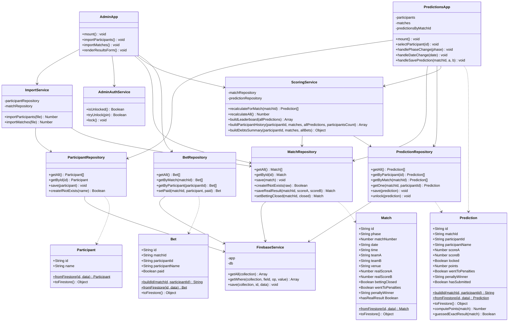
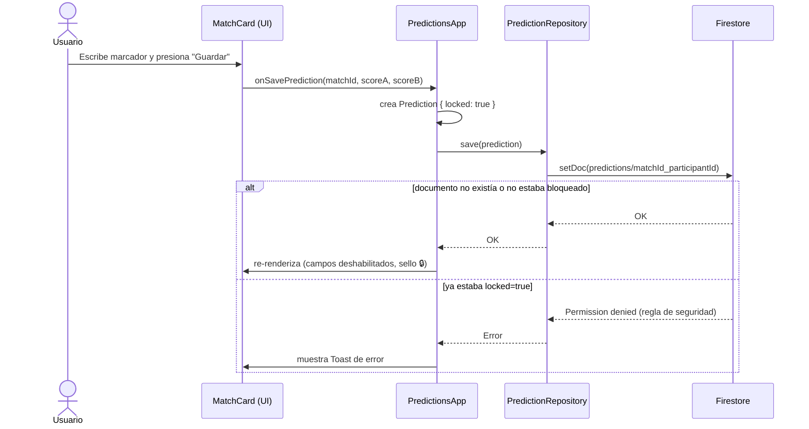
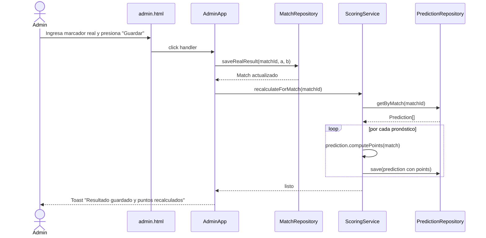

# Diagramas UML

## Diagrama de clases

```mermaid
classDiagram
    class Participant {
        +String id
        +String name
        +fromFirestore(id, data)$ Participant
        +toFirestore() Object
    }

    class Match {
        +String id
        +String phase
        +Number matchNumber
        +String date
        +String time
        +String teamA
        +String teamB
        +String venue
        +Number realScoreA
        +Number realScoreB
        +Boolean bettingClosed
        +Boolean wentToPenalties
        +String penaltyWinner
        +fromFirestore(id, data)$ Match
        +toFirestore() Object
        +hasRealResult Boolean
    }

    class Prediction {
        +String id
        +String matchId
        +String participantId
        +String participantName
        +Number scoreA
        +Number scoreB
        +Boolean locked
        +Number points
        +Boolean wentToPenalties
        +String penaltyWinner
        +Boolean hasSubmitted
        +buildId(matchId, participantId)$ String
        +fromFirestore(id, data)$ Prediction
        +toFirestore() Object
        +computePoints(match) Number
        +guessedExactResult(match) Boolean
    }

    class Bet {
        +String id
        +String matchId
        +String participantId
        +String participantName
        +Boolean paid
        +buildId(matchId, participantId)$ String
        +fromFirestore(id, data)$ Bet
        +toFirestore() Object
    }

    class FirebaseService {
        -app
        -db
        +getAll(collection) Array
        +getWhere(collection, field, op, value) Array
        +save(collection, id, data) void
    }

    class ParticipantRepository {
        +getAll() Participant[]
        +getById(id) Participant
        +save(participant) void
        +createIfNotExists(name) Boolean
    }

    class MatchRepository {
        +getAll() Match[]
        +getById(id) Match
        +save(match) void
        +createIfNotExists(raw) Boolean
        +saveRealResult(matchId, scoreA, scoreB) Match
        +setBettingClosed(matchId, closed) Match
    }

    class PredictionRepository {
        +getAll() Prediction[]
        +getByParticipant(id) Prediction[]
        +getByMatch(matchId) Prediction[]
        +getOne(matchId, participantId) Prediction
        +save(prediction) void
        +unlock(prediction) void
    }

    class BetRepository {
        +getAll() Bet[]
        +getByMatch(matchId) Bet[]
        +getByParticipant(participantId) Bet[]
        +setPaid(matchId, participant, paid) Bet
    }

    class ScoringService {
        -matchRepository
        -predictionRepository
        +recalculateForMatch(matchId) Prediction[]
        +recalculateAll() Number
        +buildLeaderboard(allPredictions) Array
        +buildParticipantHistory(participantId, matches, allPredictions, participantsCount) Array
        +buildDebtsSummary(participantId, matches, allBets) Object
    }

    class ImportService {
        -participantRepository
        -matchRepository
        +importParticipants(file) Number
        +importMatches(file) Number
    }

    class AdminAuthService {
        +isUnlocked() Boolean
        +tryUnlock(pin) Boolean
        +lock() void
    }

    class PredictionsApp {
        -participants
        -matches
        -predictionsByMatchId
        +mount() void
        +selectParticipant(id) void
        +handlePhaseChange(phase) void
        +handleDateChange(date) void
        +handleSavePrediction(matchId, a, b) void
    }

    class AdminApp {
        +mount() void
        +importParticipants() void
        +importMatches() void
        +renderResultsForm() void
    }

    ParticipantRepository --> FirebaseService
    MatchRepository --> FirebaseService
    PredictionRepository --> FirebaseService
    BetRepository --> FirebaseService
    ParticipantRepository ..> Participant
    MatchRepository ..> Match
    PredictionRepository ..> Prediction
    BetRepository ..> Bet

    ScoringService --> MatchRepository
    ScoringService --> PredictionRepository
    ImportService --> ParticipantRepository
    ImportService --> MatchRepository

    PredictionsApp --> ParticipantRepository
    PredictionsApp --> MatchRepository
    PredictionsApp --> PredictionRepository
    PredictionsApp --> ScoringService
    PredictionsApp ..> Prediction

    AdminApp --> ImportService
    AdminApp --> AdminAuthService
    AdminApp --> MatchRepository
    AdminApp --> ScoringService
    AdminApp --> BetRepository
```

## Flujo: guardar un pronóstico

```mermaid
sequenceDiagram
    actor Usuario
    participant UI as MatchCard (UI)
    participant App as PredictionsApp
    participant Repo as PredictionRepository
    participant FS as Firestore

    Usuario->>UI: Escribe marcador y presiona "Guardar"
    UI->>App: onSavePrediction(matchId, scoreA, scoreB)
    App->>App: crea Prediction { locked: true }
    App->>Repo: save(prediction)
    Repo->>FS: setDoc(predictions/matchId_participantId)
    alt documento no existía o no estaba bloqueado
        FS-->>Repo: OK
        Repo-->>App: OK
        App->>UI: re-renderiza (campos deshabilitados, sello 🔒)
    else ya estaba locked=true
        FS-->>Repo: Permission denied (regla de seguridad)
        Repo-->>App: Error
        App->>UI: muestra Toast de error
    end
```

## Flujo: admin carga un resultado real

```mermaid
sequenceDiagram
    actor Admin
    participant UI as admin.html
    participant App as AdminApp
    participant MatchRepo as MatchRepository
    participant Scoring as ScoringService
    participant PredRepo as PredictionRepository

    Admin->>UI: Ingresa marcador real y presiona "Guardar"
    UI->>App: click handler
    App->>MatchRepo: saveRealResult(matchId, a, b)
    MatchRepo-->>App: Match actualizado
    App->>Scoring: recalculateForMatch(matchId)
    Scoring->>PredRepo: getByMatch(matchId)
    PredRepo-->>Scoring: Prediction[]
    loop por cada pronóstico
        Scoring->>Scoring: prediction.computePoints(match)
        Scoring->>PredRepo: save(prediction con points)
    end
    Scoring-->>App: listo
    App-->>Admin: Toast "Resultado guardado y puntos recalculados"
```
